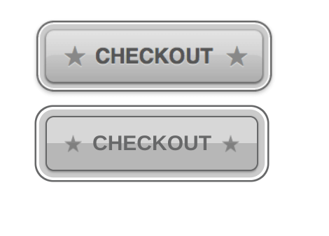
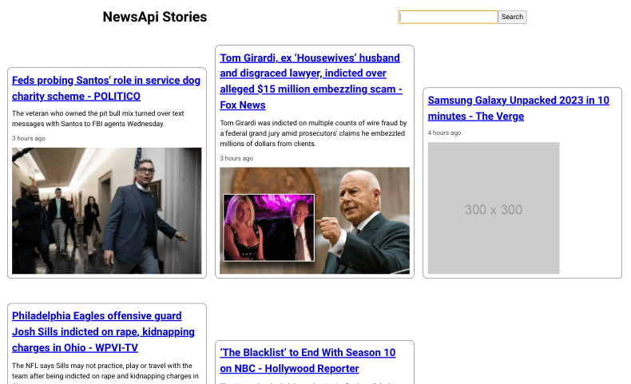
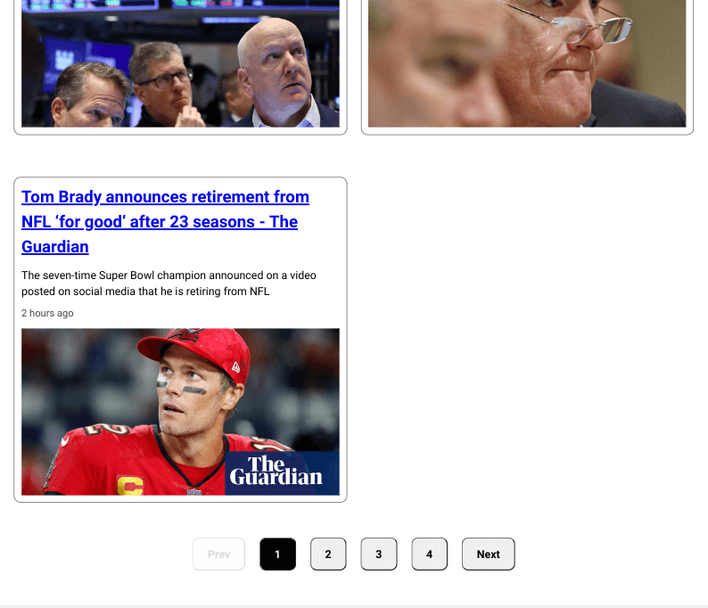
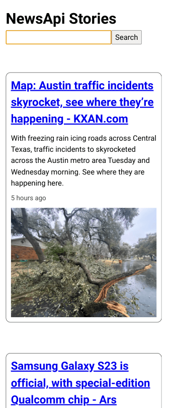
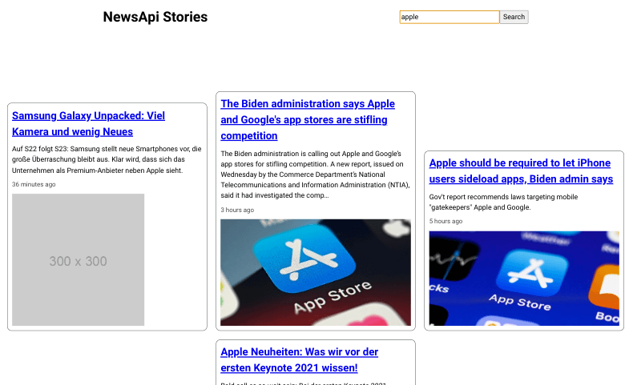
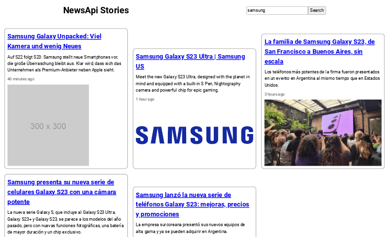
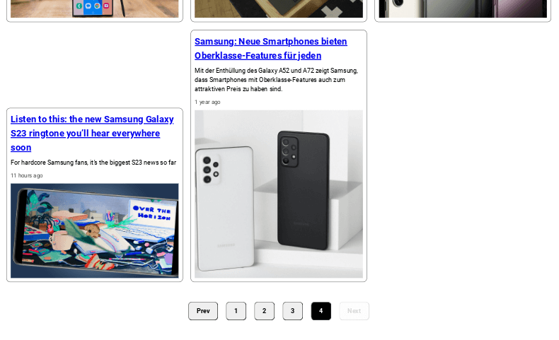

# Noni Front End Developer Coding Challenge

This is my solution to this [outgive-inc's repo](https://github.com/outgive-inc/css-javascript-test).

## Screenshots 



***



***


***



***


***



***



***



***



***

## OBJECTIVE

You are going to create a simple news page application. It will pull new articles from an API and display them. Use your creativity and design skills to make the page your own. Be sure to make the page responsive as well.

## INSTRUCTIONS

### PART 1: CSS

Using CSS properties alone, recreate the button on the page. DO NOT change the html to acheive the desired look, only CSS.

### PART 2: Javascript

Connect to the provided API and pull the news articles with a GET request.

After you have been able to pull and display the data, add three JavaScript based features.

1.  Add the ability to filter the news articles from the API by title from an input box

2.  Display an error message if nothing is found matching the search criteria

3.  Add pagination to iterate the list of news articles you’ve displayed. Show only 5 articles at a time

Be sure to style your creation as magnificently as you can.

API Endpoint: https://newsapi.org/v2/top-headlines?country=us&apiKey=

Use any technologies that you are comfortable with such as Vue, React, Angular, or Bootstrap. Feel free to spend as much or as little time as you'd like.

**\*NOTE:** You are open to change the file structure to complete the JavaScript part of the challenge. Do whatever you are comfortable with\*

## Built With

- React
- React Router v6.4+
- [News API](https://newsapi.org/docs) 

## Part 1 Thoughts

- In chrome, the star emojis would not show up 
- I think you have to serve the html to be allowed to see emojis now
- Using box-shadow is a better approach than using multiple borders
- Used image-color-picker to try and match colors
- Font seems to be Neue Helvetica - not a free font
- Stars are slightly smaller than picture 

## Part 2 Thoughts 

- part-2 needs to be lowercase to be able to run create-react-app inside of the folder
- Tested out new React Router loaders
- The news articles don't have ids - used query param approach to render on a new page
- Thought about having a toggle to show content for the article but the content is clipped 
- Using a toggle requires another component to track internal state for all list items
- It is recommended to include an .env in source control
- Typically, I usually add .env to the .gitignore 
- .env.local acts just like a .env during development
- loader api requests could be pulled out and put into a utils folder and then you'd import the function you need
- Used [blog article](https://hygraph.com/blog/react-pagination) to quickly add pagination, but implementation had problems with accessibility and didn't disable prev/next buttons 
- Paginate in the NewsList component - move to App component?
- Putting Paginate component inside App component will break SearchResults page
- NewsList component is re-used inside SearchResults component - would need context or refactoring 
- Have to check all properties exist in jsx 
- Had instance where article url was a youtube clip - could add as an i-frame?
- Had author in the news article body - changed to use the date instead 
- timeago-react is a pretty good package, but it adds a ton of module warnings in the terminal
- Added placeholder image from [Placeholder.com](https://placeholder.com/) if an image was missing
- Pagination and search - it would stay on page you were on - i.e. it would not always show first page results - and if there weren't enough results, user would see nothing but the pagination buttons - user would have to click on the prev button (potentially multiple times) to see the search result articles
- Fixed by searching for urlSearchParams and using a useEffect to reset the currentPage to 1, if any searchParam exists - you can search repeatedly without hassle
- Made grid responsive across mobile, tablet, and desktop screen sizes.
- Could make further adjustments for very large screens.
- Styling is tougher when picture size is allowed to vary - I used flex-end to align pictures at the bottom of the grid row
- Could crop the pictures or give them a set width and height and use aspect-ratio to fix them.  
- Just made the headline clickable - could have made the picture clickable or the whole card like google news does

## How to Use

To clone and run this application, you'll need [Git](https://git-scm.com) and [Node.js](https://nodejs.org/en/download/) (which comes with [npm](http://npmjs.com)) installed on your computer. From your command line:

```bash
# Clone this repository 
$ git clone https://jdegand.github.io/css-javascript-test

# Install dependencies
$ cd css-javascript-test/part-2
$ npm install

# Add api key to .env and run
$ npm start
```

## Useful Resources

- [Placeholder](https://placeholder.com/)
- [Stack Overflow](https://stackoverflow.com/questions/41574855/how-to-add-two-stars-in-css-through-after) - how to add two stars in css 
- [Unicode Table](https://unicode-table.com/en/2605/) - star unicode
- [CSS Tricks](https://css-tricks.com/snippets/css/multiple-borders/) - multiple borders
- [GetFishTank](https://www.getfishtank.com/blog/best-practices-for-committing-env-files-to-version-control) - best practices for committing env files
- [ui.dev](https://ui.dev/react-router-pass-props-to-link) - react router pass props to link
- [FreeCodeCamp](https://www.freecodecamp.org/news/build-a-custom-pagination-component-in-react/) - custom pagination in react
- [Blog](https://levelup.gitconnected.com/a-simple-guide-to-pagination-in-react-facd6f785bd0) - guide to pagination in react
- [Hygraph](https://hygraph.com/blog/react-pagination) - react pagination
- [Github](https://github.com/olawanlejoel/GraphCMS-react-pagination) - react pagination